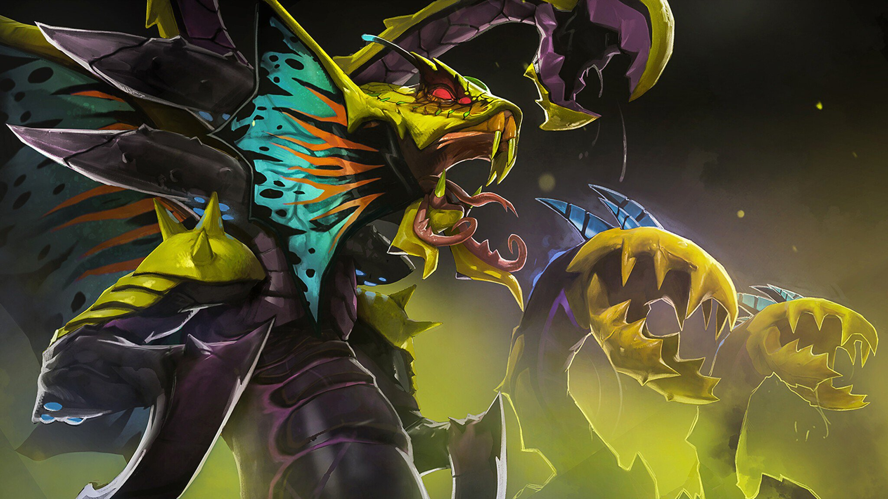

# Venomancer - An Imperceptible and Target-on-Demand Backdoor Attack in Federated Learning

"Venomancer brings slow death to its enemies. It infects other living beings by its very Noxious Touch, and spewed Venomous Gales to slow and poison escaping prey. Part reptile and part orchid, it sprouts an endless army of toxin-spitting sentinels, the Plague Wards, to defend its perimeters with Acid Spit. Should foes draw near, they are sprayed with a massive, noxious Poison Nova, ensuring that even those who get away eventually succumb to the Venomancer's many Latent Toxins."
